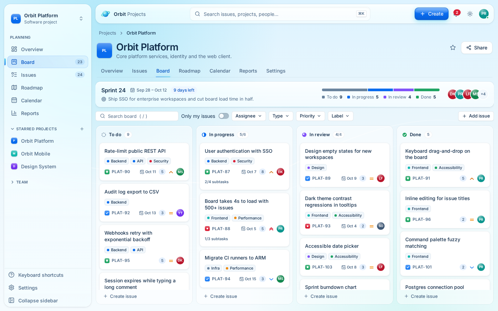
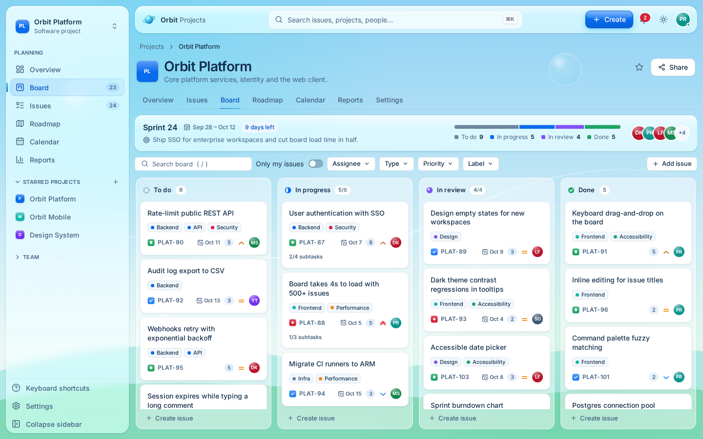
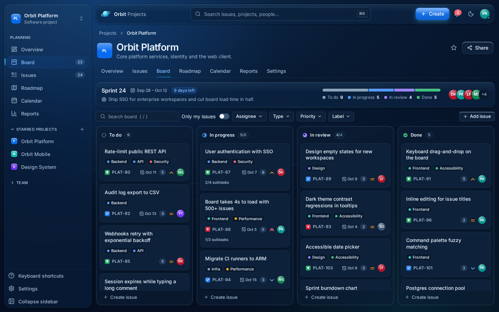
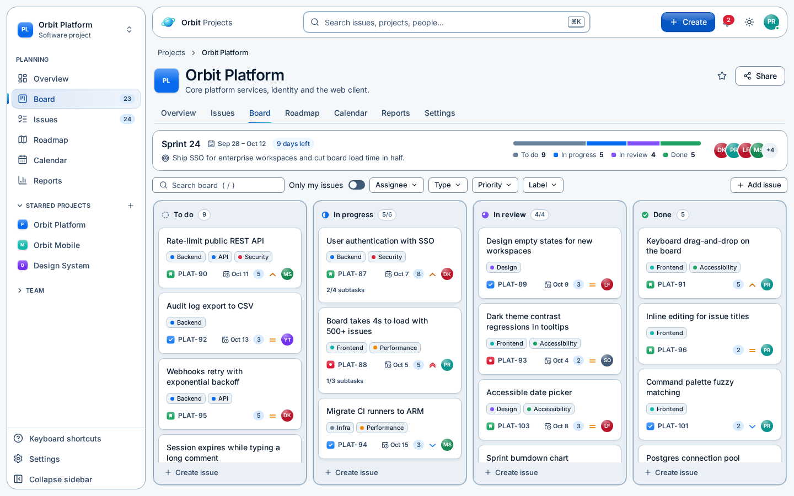
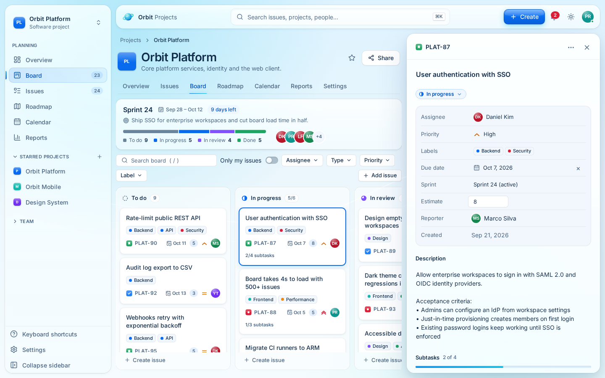

# Orbit UI

**A modern Frutiger Aero design system and React component library for professional productivity software.**

Orbit combines the optimism of Frutiger Aero (sky blues, aqua, frosted glass, soft light) with the restraint of an enterprise design system: clear hierarchy, opaque readable content, accessible interactions and predictable performance.



| Aero Scenic                             | Aero Dark                           | Accessible                                      |
| --------------------------------------- | ----------------------------------- | ----------------------------------------------- |
|  |  |  |

## What's in the box

| Path              | Package         | What it is                                                                                                                                                                                                                                                                                                                                        |
| ----------------- | --------------- | ------------------------------------------------------------------------------------------------------------------------------------------------------------------------------------------------------------------------------------------------------------------------------------------------------------------------------------------------- |
| `packages/tokens` | `@orbit/tokens` | Primitive scales, 4 semantic themes, glass materials, typography, spacing, radii, shadows, blur, motion, z-index and density — as CSS custom properties **and** typed TypeScript. Includes contrast utilities.                                                                                                                                    |
| `packages/icons`  | `@orbit/icons`  | Lucide re-export plus Orbit glyphs (logo, issue-type icons).                                                                                                                                                                                                                                                                                      |
| `packages/ui`     | `@orbit/ui`     | ~60 React components: foundation, Aero signature components and project-management product components. Typed, ref-forwarding, accessible, tree-shakeable.                                                                                                                                                                                         |
| `apps/storybook`  | —               | **The design source of truth.** Every component, state, theme, density and composed pattern, with interaction + axe tests.                                                                                                                                                                                                                        |
| `apps/showcase`   | —               | **Orbit Projects**, a Jira-like demo app that consumes `@orbit/ui` as a package.                                                                                                                                                                                                                                                                  |
| `docs/`           | —               | Guides: [getting started](docs/getting-started.md), [design philosophy](docs/design-philosophy.md), [tokens](docs/tokens.md), [components](docs/components.md), [theming](docs/theming.md), [accessibility](docs/accessibility.md), [performance](docs/performance.md), [contributing](docs/contributing.md), [build & release](docs/release.md). |

## Quick start

Requirements: **Node ≥ 20.19** and **pnpm 10** (`corepack enable` or `npm i -g pnpm@10`).

```bash
pnpm install
pnpm dev          # Orbit Projects demo → http://localhost:5173
pnpm storybook    # Storybook → http://localhost:6006
pnpm build        # tokens, icons, ui, demo and Storybook production builds
pnpm test         # unit, interaction (Storybook play) and token contrast tests
```

More commands:

| Command                           | What it does                                                                                                              |
| --------------------------------- | ------------------------------------------------------------------------------------------------------------------------- |
| `pnpm test:e2e`                   | Builds the packages + demo and runs Playwright end-to-end, axe (incl. colour contrast in all themes) and web-vitals tests |
| `pnpm test:visual`                | Playwright visual regression (`-- --update-snapshots` to refresh baselines)                                               |
| `pnpm typecheck`                  | Strict TypeScript across all workspaces                                                                                   |
| `pnpm lint` / `pnpm format:check` | ESLint (incl. jsx-a11y, react-hooks) / Prettier                                                                           |
| `pnpm verify:package`             | Packs the libraries, installs the tarballs into a throwaway app, type-checks and server-renders them                      |
| `pnpm docs:tokens`                | Regenerates `docs/tokens.md` from the token source                                                                        |
| `pnpm check`                      | Everything above, in CI order                                                                                             |

> First run of the e2e/visual suites needs Playwright's Chromium: `pnpm --filter @orbit/showcase exec playwright install chromium`.

## Using the library

```bash
pnpm add @orbit/ui @orbit/tokens @orbit/icons
```

```tsx
import "@orbit/tokens/tokens.css";
import "@orbit/ui/styles.css";

import { AeroButton, Badge, GlassPanel, IssueCard, ThemeProvider } from "@orbit/ui";

export function Example() {
  return (
    <ThemeProvider defaultTheme="minimal" storageKey="my-app:theme">
      <GlassPanel variant="standard" elevation="raised">
        <IssueCard
          issueKey="PLAT-87"
          title="User authentication with SSO"
          type="story"
          priority="high"
          assignee={{ name: "Daniel Kim" }}
        />
        <Badge variant="info">Backend</Badge>
        <AeroButton>Create issue</AeroButton>
      </GlassPanel>
    </ThemeProvider>
  );
}
```

See [Getting started](docs/getting-started.md) for fonts, Tailwind integration, SSR and the full API overview.

## The demo: Orbit Projects

A functional project-management app built only from `@orbit/ui` components (no component code is duplicated in the app):

- **Board** — drag-and-drop between and within columns (mouse, touch and keyboard), WIP limits, empty states, quick-create per column, a non-drag "Move to…" menu, search + assignee/type/priority/label filters, "only my issues", loading skeleton.
- **Issue inspector** — docked beside the board on desktop, full-screen on mobile: inline title/description editing, status, assignee, priority, labels, due date, sprint, estimate, subtasks with progress, comments, activity log, copy link, delete with confirmation. Deep-linkable (`#/board/PLAT-87`).
- **Issues** — virtualised backlog list; toggle 2,000 synthetic issues to see virtualisation at work.
- **Overview** — stat tiles, sortable team-workload data grid, status breakdown, recent activity.
- **Settings** — theme, density, reduce transparency/motion, reset demo data.
- **Global** — ⌘K command palette (navigation, themes, issue search), keyboard shortcuts (`C`, `/`, `[`, `?`), notifications, toasts, responsive drawer navigation.
- Edits persist to `localStorage`.

Roadmap, Calendar and Reports tabs are **intentionally not implemented** and say so ("Not in demo"). Project switching and "starring" show an explanatory toast.



## Verified status

Everything below was run in this repository (2-vCPU Linux VM, headless Chromium 1.63):

| Check                                                 | Result                                                                        |
| ----------------------------------------------------- | ----------------------------------------------------------------------------- |
| `pnpm typecheck` · `pnpm lint` · `pnpm format:check`  | clean                                                                         |
| `pnpm test` (Vitest: tokens + ui + Storybook stories) | 182 passed, 1 skipped (keyboard drag — covered by Playwright)                 |
| `pnpm test:e2e` (Playwright + axe + web vitals)       | 19 passed                                                                     |
| `pnpm test:visual`                                    | 6 baselines, stable on re-run                                                 |
| `pnpm build` (packages, demo, Storybook)              | succeeds                                                                      |
| `pnpm verify:package`                                 | packed tarballs type-check, SSR-render and resolve CSS in an external project |

## Known limitations

- **Roadmap / Calendar / Reports** views are placeholders in the demo. Project switching is simulated.
- **Kanban + very large boards**: columns paginate (`pageSize`, default 60) rather than virtualise, because virtualised drop targets complicate drag-and-drop. Lists and grids (`BacklogList`, `DataGrid`) are fully virtualised.
- **INP on GPU-less CI** exceeds 200 ms for full-page repaints such as theme switching, because frames are rasterised in software. LCP and CLS are well within budget. See [performance](docs/performance.md) for measured values and how to run the strict check.
- **Visual baselines** are platform-specific (fonts, antialiasing); regenerate them on your CI image.
- **Combobox/DatePicker** triggers show invalid state visually and link the error via `aria-describedby`; `aria-invalid` is not set on `button` triggers because the ARIA spec doesn't support it there.
- Tested in Chromium. Firefox and Safari are supported by the CSS used (with `@supports` fallbacks for `backdrop-filter`), but they're not part of the automated suite yet.
- Packages are versioned `0.1.0` and not yet published to a registry. See [release](docs/release.md).

## License

MIT
